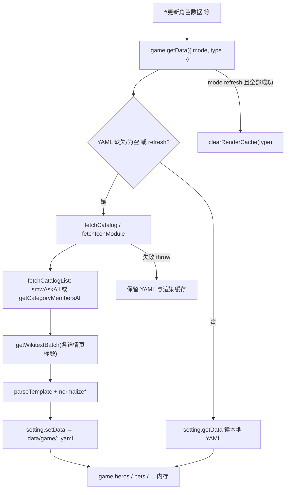
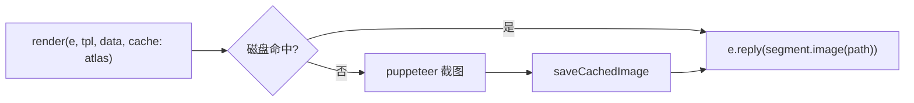

# Wiki 数据链路与图鉴渲染缓存

> 专题 04：图鉴数据来源、本地 YAML 缓存、渲染图片磁盘缓存。  
> 上级索引：[memory/README.md](./README.md)

---

## 1. Wiki 站点与 API

- 站点：[蓝色星原 BWIKI](https://wiki.biligame.com/ap/)
- HTTP 入口：`https://wiki.biligame.com/ap/api.php`
- 实现：[`api/wiki/client.js`](../api/wiki/client.js)
  - `wikiFetch`：统一请求；必须带 `Referer: https://wiki.biligame.com/ap/`，否则 EdgeOne 常返回 **HTTP 567**；567/429/503 自动重试
  - `smwAsk` / `smwAskAll`：Semantic MediaWiki `#ask` 分页查询（列表 + printout 元数据）
  - `getCategoryMembersAll`：MediaWiki `list=categorymembers`（SMW 失败时的列表 fallback）
  - `getWikitextBatch`：批量拉取页面 wikitext（详情页源码）
  - `getWikiImageUrl`：图片 URL 解析

**旧方案（已删除）**：

- Lua 模块 `模块:Hero/id`、`nodemw` 直读角色列表
- 内置 `resources/wiki-modules/*.lua` 离线兜底（已删；基础数据与图鉴统一 **仅 Wiki → YAML**，失败即报错）

**现方案**：**列表 → 详情页 wikitext → 模板解析 → YAML**。列表与 BWIKI「角色图鉴」等页面展示同源（分类 `分类:角色` 等），详情即各条目 Wiki 页（如 [寒悠悠](https://wiki.biligame.com/ap/%E5%AF%92%E6%82%A0%E6%82%A0) 内的 `{{角色图鉴|...}}`）。

---

## 2. 五类图鉴数据映射

定义于 [`api/wiki/catalog.js`](../api/wiki/catalog.js) 的 `CATALOGS`：

| 类型 | 列表页（BWIKI） | SMW / 分类 | 详情页模板 | game 字段 | YAML 路径 |
|------|-----------------|------------|------------|-----------|-----------|
| Hero | [角色图鉴](https://wiki.biligame.com/ap/%E8%A7%92%E8%89%B2%E5%9B%BE%E9%89%B4) | `分类:角色` | `{{角色图鉴}}` | `game.heros` | `data/game/hero.yaml` |
| Kibo | 奇波图鉴 | `分类:奇波` | `{{奇波图鉴}}` | `game.pets` | `data/game/pet.yaml` |
| Spirit | 灵子图鉴 | `分类:灵子` | `{{灵子图鉴}}` | `game.spirits` | `data/game/spirit.yaml` |
| Accessory | 装备图鉴 | `分类:装备` | `{{装备图鉴}}` | `game.accessories` | `data/game/accessory.yaml` |
| Item | 物品图鉴 | `分类:物品` | `{{物品图鉴}}` | `game.items` | `data/game/item.yaml` |

**Base 数据**（元素 / 职业 / 阵营）：首次从 Wiki Lua 模块拉取，写入本地 YAML 后只读缓存。

| 字段 | Wiki 模块页 | YAML 路径 | 实现 |
|------|-------------|-----------|------|
| element | `模块:Icon/element` | `data/game/element.yaml` | [`api/wiki/luaModule.js`](../api/wiki/luaModule.js) `fetchIconModule` |
| groups | `模块:Icon/groups` | `data/game/groups.yaml` | 同上 |
| profession | `模块:Icon/profession` | `data/game/profession.yaml` | 同上 |

`luaparse` 解析模块页 `p.data = { ... }`，**无内置 fallback**；Wiki 失败时 `getBaseData` 抛错（与图鉴一致）。

---

## 3. 数据拉取流程



### 3.1 `fetchCatalog(type)`（五类图鉴）

[`api/wiki/catalog.js`](../api/wiki/catalog.js)：

1. **列表**：`fetchCatalogList(config)` — 优先 `smwAskAll(config.query)`（含稀有度、元素等 printout）；失败则 `getCategoryMembersAll(config.category)`（与「角色图鉴」页条目一致）
2. **详情**：`getWikitextBatch(titles)` — 批量拉各角色/奇波等 Wiki 页 wikitext
3. **解析**：`parseTemplate(wikitext, config.template)` — 如 `{{角色图鉴|id=101003|名称=寒悠悠|...}}`
4. **归一化**：`config.normalize(params, smwRow)` → 插件结构
5. **落盘**：[`utils/game.js`](../utils/game.js) `setting.setData` → `data/game/*.yaml`

示例（Hero）：列表 21 条 → 逐页解析 → `hero.yaml`；单条字段与 [寒悠悠](https://wiki.biligame.com/ap/%E5%AF%92%E6%82%A0%E6%82%A0) 详情页模板一致。

### 3.2 `getBaseData(mode)`（元素 / 阵营 / 职业）

[`utils/game.js`](../utils/game.js) `getBaseData`：

1. `shouldFetchWiki(mode, isEmpty, cacheMissing)` — YAML **文件不存在**、内存为空、或 `mode: refresh` 时拉 Wiki
2. `fetchIconModule('element'|'groups'|'profession')` → 写入对应 yaml
3. 之后启动只读本地 yaml，不再请求 Wiki（除非 `#更新` 或删 yaml 重装）

### 3.3 归一化层

[`api/wiki/normalize/`](../api/wiki/normalize/)：`hero.js` / `kibo.js` / `spirit.js` / `accessory.js` / `item.js`

### 3.4 Lookup

[`api/wiki/lookup.js`](../api/wiki/lookup.js)：元素色、职业、阵营、奇波标签等，读本地 yaml。

### 3.5 统一导出

[`api/wiki/data.js`](../api/wiki/data.js) 对外 export `fetchCatalog`、`buildKiboEvolutionChains` 等。

---

## 4. 命令与加载入口

| 命令 | 处理 | 文件 |
|------|------|------|
| `#角色列表` / `#xxx图鉴` | 列表 / 详情渲染 | [`apps/atlas.js`](../apps/atlas.js) |
| `#更新角色数据` 等 | `game.getData({ mode: 'refresh', type: 'Hero' })` | [`apps/atlas.js`](../apps/atlas.js) `updateAtlas` |

`index.js` 在加载 apps 前 `await game.ready`（`bootstrap` → `getData({ mode: 'init' })`）。

### 4.1 `getData` 模式

| mode | 行为 | 典型调用 |
|------|------|----------|
| `init` | YAML **缺失**、内存为空、或 refresh 时才 fetch | 插件启动 `bootstrap` |
| `refresh` | 始终 fetch；Hero 全量替换；成功后 `clearRenderCache` | `#更新xxx数据` |

兼容旧签名：`getData(true)` → init，`getData(false, 'Hero')` → refresh。

fetch 失败时 `fetchCatalog` 抛错，`getData` 不会清渲染缓存，`updateAtlas` 回复失败。

---

## 5. 图鉴渲染缓存

### 5.1 动机

YAML 已缓存 Wiki 数据，但每次查图鉴仍走 **HTML 模板 + puppeteer 截图**。重复查询同一列表/详情时，应直接返回已生成的图片。

### 5.2 实现位置

- [`utils/renderCache.js`](../utils/renderCache.js)：key 生成、磁盘读写、按类型清除
- [`utils/render.js`](../utils/render.js)：命中短路 /  miss 后落盘

磁盘目录（不入 git）：

```
plugins/yoyo-plugin/data/cache/render/
  atlas/
    hero/list.jpg
    hero/{id}/{typeKey}.jpg
    pet/list.jpg
    pet/{id}.jpg
    spirit/ ...
    item/ ...
    accessory/list.jpg
  panel/          # 预留，角色面板缓存
```

### 5.3 启用方式

图鉴命令在 `render()` 时传 `{ cache: 'atlas' }`（见 [`apps/atlas.js`](../apps/atlas.js)）。

**不缓存**的场景（不传 `cache`）：

- [`apps/hero.js`](../apps/hero.js) 别名图鉴（含用户 `nicknames`）
- 帮助、签到、日历、用户上传图片列表等

### 5.4 缓存 key 规则

`buildAtlasKey(tpl, renderData)`：

| 模板 | key 示例 |
|------|----------|
| `hero/list` | `hero/list` |
| `hero/atlas` | `hero/101003/skill-talent`（`type` 数组排序后拼接） |
| `pet/list` | `pet/list` |
| `pet/atlas` | `pet/500001` |
| `spirit/list` | `spirit/list` |
| `item/list` | `item/list` |
| `accessory/list` | `accessory/list` |

启用 atlas 缓存时使用**固定背景** `/common/pet/background.png`，避免随机奇波背景导致同 key 不同图。

### 5.5 命中流程



### 5.6 失效（清除缓存）

[`utils/game.js`](../utils/game.js) 在 **`mode: 'refresh'` 且整段 `getData` 成功结束** 后调用 `clearRenderCache(type)`。fetch 失败则不清缓存。

| `type` | 清除目录 |
|--------|----------|
| `Hero` | `atlas/hero/` |
| `Kibo` | `atlas/pet/` |
| `Spirit` | `atlas/spirit/` |
| `Item` | `atlas/item/` |
| `Accessory` | `atlas/accessory/` |
| 未指定（全量更新） | `atlas/` 全部 |

触发命令：`#更新图鉴数据`、`#更新角色数据`、`#更新奇波数据` 等。

### 5.7 角色面板缓存（预留）

- scope：`CACHE_SCOPE.PANEL`（`panel/` 目录）
- API：`buildPanelKey(uid, tpl)`、`clearPanelCache(uid)` — 已在 `renderCache.js` 预留
- **暂未接入**：待角色面板渲染实现后，在用户 `#更新面板` 时调用 `clearPanelCache(uid)`

---

## 6. UI 图标下载

- 实现：[`utils/UI.js`](../utils/UI.js)，**全部 game 数据加载完成后**调用一次；扫描 help + game 数据，**仅下载磁盘缺失**的 `tex_*` 文件；角色立绘按 `tex_icon_hero_get_{id}.png` 显式入队
- **唯一来源**：BWIKI `getWikiImageUrl`（[`api/wiki/client.js`](../api/wiki/client.js)）
- 落盘：`resources/UI/{文件名}`；失败记录：`data/logs/ui-logs.yaml`
- 已移除 Gitee 备用源、`config.iconSource`、以及 `excludeIconReg` 图标排除列表
- **角色立绘**：`normalize/hero.js` 生成 `portraitIcon: tex_icon_hero_get_{id}.png`（与 BWIKI 模板约定一致）；详情页 [`resources/hero/atlas.html`](../resources/hero/atlas.html) 展示

---

## 7. 相关 import

```js
import { fetchCatalog } from '../api/wiki/data.js'           // 图鉴 Wiki 拉取
import { fetchIconModule } from '../api/wiki/luaModule.js'     // 元素/阵营/职业
import { clearRenderCache } from './renderCache.js'          // 清图鉴渲染缓存
import render, { clearPanelCache } from '#render'            // 渲染 + 预留面板清缓存
```

---

## 8. 维护清单

- Wiki 模板字段变更 → 改 `normalize/*` + 必要时改 HTML 模板
- 新增图鉴类型 → `catalog.js` + `game.js` + `atlas.js` + 本 doc 映射表
- 新增可缓存页面 → `render` 传 `cache: 'atlas'` 并确认 `buildAtlasKey` 规则
- 列表 UI：五类图鉴列表统一 `yo-catalog-*` 组件（见 [`resources/common/list.css`](../resources/common/list.css)）
- 详情页 UI（角色/奇波/签到布局、CSS 禁忌）：见 [`05-render-ui-styles.md`](./05-render-ui-styles.md)
- 奇波技能 yaml 字段：`descLevels`、`level`、`descHtml`（`parseKiboSkillDesc`）；旧 yaml 仅合并 `desc` 时用 legacy 解析兜底
- 面板上线 → 实现 `cache: 'panel'` 并在 `#更新面板` 调 `clearPanelCache`
- **勿恢复** `resources/wiki-modules/`：基础数据与图鉴均 Wiki 单次拉取 + YAML 缓存；内置副本易过期（如 profession 少「赋予」）
- Wiki API 567 → 检查 `client.js` 的 `Referer` / 重试；勿去掉浏览器头
