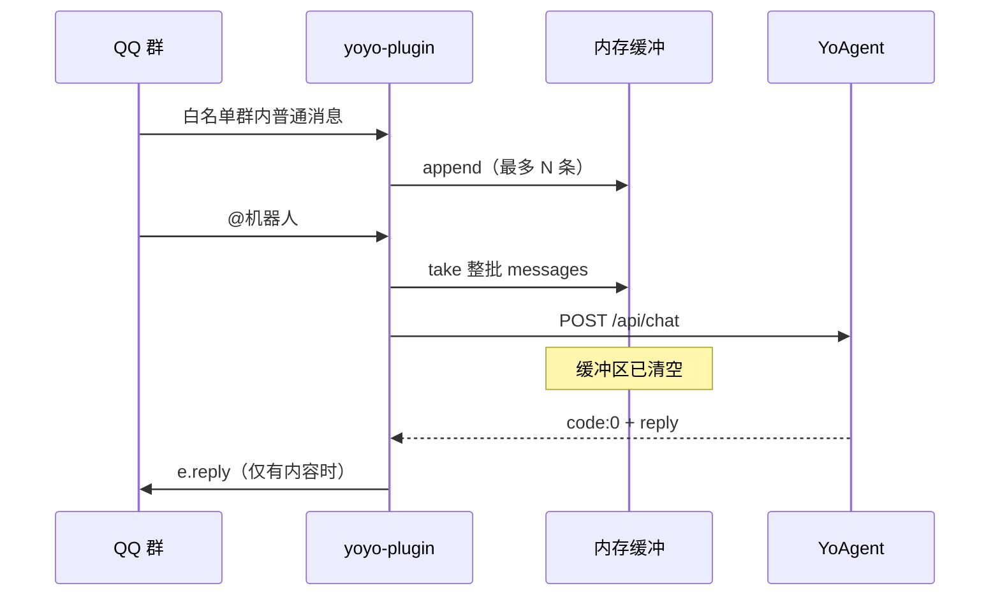

# 悠悠 / YoAgent 对接（唯一文档）

> **读者**：yoyo-plugin 维护者 · YoAgent 开发者 / AI  
> **协议版本**：2026-06（内存缓冲 + OneBot 原格式透传）  
> **YoAgent 深度文档**：实现需求、架构、进度见 [`agent/README.md`](./agent/README.md)（原 `server/memory/` 已合并至此）

---

## 目录

1. [架构概览](#1-架构概览)
2. [yoyo-plugin 侧](#2-yoyo-plugin-侧)
3. [YoAgent HTTP 接口](#3-yoagent-http-接口)
4. [请求体 Schema](#4-请求体-schema)
5. [OneBot 消息段](#5-onebot-消息段)
6. [响应体 Schema](#6-响应体-schema)
7. [YoAgent 实现指南](#7-yoagent-实现指南)
8. [联调](#8-联调)
9. [边界与限制](#9-边界与限制)
10. [源码索引](#10-源码索引)

---

## 1. 架构概览



| 模块 | 路径 |
|------|------|
| 入口（安装后） | `apps/agent.js` ← `#安装悠悠` |
| 内存缓冲 | `api/agent/buffer.js` |
| 载荷组装 | `api/agent/buildPayload.js` |
| HTTP 客户端 | `api/agent/client.js` |
| 路径常量 | `api/agent/schema.js` → `/api/chat`、端口 |
| 进程管理 | `utils/agent-server.js` |
| uv 安装 | `utils/uv.js` |

- **无 Redis**：`Map<session_id, messages[]>`，进程重启即清空
- **仅群聊**：`session_id = group:{群号}:bot:{机器人QQ}`
- **触发后清空缓冲**（无论 YoAgent 是否成功）；无独立 `history` 字段

---

## 2. yoyo-plugin 侧

### 2.1 配置（`config/config.yaml`）

插件侧（消息接入）：

| 字段 | 默认 | 说明 |
|------|------|------|
| `agentEnabled` | `false` | 总开关；为 `true` 时启动后自动拉起 YoAgent（见 §2.4） |
| `agentInclude` | `[]` | **白名单群号**；空数组 = 不监听任何群 |
| `agentBufferSize` | `10` | **单次 @ 对话**附带的最近群聊条数（插件侧缓冲，已实现） |
| `agentSessionHistoryTurns` | `10` | **跨轮**保留最近 N 次 @ 问答（YoAgent 进程内，重启清空） |
| `agentSessionHistoryMaxChars` | `800` | 历史单条消息最大字符 |
| `agentMemoryMaxInjectChars` | `600` | 记忆+技能目录注入 system 上限 |
| `agentMemoryCharLimit` | `2200` | 本群 MEMORY.md 字符上限 |
| `agentUserMemoryCharLimit` | `1375` | users.yaml 单群画像字符上限 |
| `agentDailyLogInjectChars` | `800` | 今/昨日誌注入上限 |
| `agentIsAt` | `true` | 需 `@` 机器人或唤醒词时触发 |
| `agentWakeWords` | `悠悠`、`小悠` | 唤醒词列表（与 `@` 等价触发，见 `api/agent/trigger.js`） |
| `agentPort` | `8787` | YoAgent 监听端口；`api/agent/schema.js` 拼 `http://127.0.0.1:{port}` |
| `agentTimeout` | `60` | 秒；超时走 catch，向用户发短提示（见 §2.3） |

YoAgent 推理侧（锅巴 / 同一 YAML，由 `server/src/core/settings.py` 读取）：

| 字段 | 默认 | 说明 |
|------|------|------|
| `agentLlmApiKey` | `""` | OpenAI 兼容 API Key |
| `agentLlmBaseUrl` | `""` | LLM 基址 |
| `agentLlmModel` | `gpt-4o-mini` | 模型名 |
| `agentMaxSteps` | `4` | Agent 最大推理步数 |
| `agentToolResultMaxChars` | `1500` | 工具结果截断 |
| `agentWebSearchProvider` | `jina` | 联网搜索 `mock` \| `jina` |
| `agentVisionEnabled` | `true` | 按需图片识别 `describe_image` |
| `agentVisionModel` | 豆包视觉模型 | 与 LLM 共用 baseUrl/key |
| `agentEmoticonEnabled` | `true` | 表情包 Sidecar + search/get 工具 |
| `agentEmoticonMaxIndexPerTurn` | `3` | 每次 @ 后台最多索引新表情数 |
| `agentEmoticonSearchLimit` | `6` | `search_emoticons` 默认条数 |
| `agentEmoticonRecencyHalfLifeDays` | `14` | 检索排序时效半衰期（天） |
| `agentLegacyFullPrompt` | `false` | `true` 时加载全部 playbook（临时兼容旧版全量 system） |
| `agentMaxReplies` | `3` | JSON 回复最多气泡数 |

完整列表见 [`config/default.yaml`](../config/default.yaml)。

### 2.2 安装与进程

| 指令 | 作用 |
|------|------|
| `#安装悠悠` | 自动安装 uv（缺失时）→ clone/pull `server/`（yoyo-sauce）→ `uv sync` → 启动 uvicorn → 拷贝 `api/agent/agent.js` → `apps/agent.js` → 约 2s 后重启云崽 |
| `#卸载悠悠` | 停止 YoAgent 进程 → 删除 `apps/agent.js` → 重启云崽 |
| `#停止悠悠` | 停止 YoAgent（`server/.yoagent.pid` + 端口占用清理） |
| `#重启悠悠` | 先停后启 YoAgent |

`apps/agent.js` 在 `.gitignore`，默认不随仓库发布。

**`#安装悠悠` 后仍需手动配置**（安装成功提示里会列出）：

1. `agentEnabled: true`
2. `agentInclude` 填入群号
3. `agentLlmApiKey` 等 LLM 配置（锅巴可配）

### 2.3 运行时行为

1. 白名单群内 **每条消息** 先入内存缓冲（`return false`，不挡其他插件）
2. **@ 机器人或唤醒词** 时 `return true`，**异步**请求 YoAgent（不阻塞消息循环）
3. 请求携带缓冲区内 **全部** 消息，然后 **清空缓冲**
4. **回复策略**（`apps/agent.js` → `runAgent`）：

| 情况 | QQ 侧行为 |
|------|-----------|
| `code: 0` 且 `reply` 有 `content` / `segments` / `type: image` | 正常 `e.reply` |
| `code: 0` 但 `reply` 为空 | 发「唔…一时想不起来，稍后再问我吧」 |
| `code !== 0`、HTTP 错误、超时、网络异常 | 写日志 + 发「刚才查资料出了点问题，稍后再试~」 |

设计意图：避免用户触发后完全无气泡；短句符合 QQ 纯文本风格（见 `server/src/agent/prompts/system/core.md`）。

### 2.4 YoAgent 进程管理

实现：[`utils/agent-server.js`](../utils/agent-server.js)、[`utils/uv.js`](../utils/uv.js)。

| 能力 | 说明 |
|------|------|
| 自动拉起 | `utils/setting.js` 初始化时 `ensureAgentServerIfEnabled`：`agentEnabled` 且端口未监听则启动 |
| 启动 | `spawn` `server/.venv/bin/uvicorn src.main:app --host 0.0.0.0 --port {agentPort}`，日志追加 `server/yoagent.log`，PID 写 `server/.yoagent.pid` |
| 依赖 | 首次无 `.venv` 时 `uv sync`（Python 镜像：`UV_PYTHON_INSTALL_MIRROR` 中科大源） |
| uv 缺失 | `#安装悠悠` 时 `ensureUv(autoInstall=true)` 从中科大镜像下载到 `bin/uv` |
| 停止 | SIGTERM → `pkill` uvicorn → 必要时 `fuser -k` 释放端口 |
| 端口冲突 | 启动前检测；占用时提示先 `#停止悠悠` 或 `#重启悠悠` |

### 2.5 上下文三层

| 层 | 配置 | 默认 | 存储 | 说明 |
|----|------|------|------|------|
| 单次群聊缓冲 | `agentBufferSize` | 10 条 | 插件进程内 | 本次 @ 附带的最近群消息 |
| 跨轮对话 | `agentSessionHistoryTurns` | 10 次 | YoAgent 进程内 | 最近 @ 问答；重启丢失 |
| **持久学习** | `agentMemoryMaxInjectChars` | 600 字 | 磁盘 MEMORY/users/logs | 长期事实 + 用户画像（**不含情绪日志**） |

持久记忆路径（均在 `src/agent/` 下）：

- 代码：`src/agent/memory/*.py`
- 全局数据：`src/agent/memory/data/global/MEMORY.md`
- 按群：`src/agent/memory/data/group/{group_id}/`（`MEMORY.md`、`users.yaml`、`logs/`）
- 内置技能：`src/agent/skills/*/SKILL.md`

写入：`memory` 工具 + 回复后异步 `extract.py`（经 `guards`）。检索：`memory_search` / `memory_get`。规格见 [`memory/agent/requirements/memory-system.md`](agent/requirements/memory-system.md)、重构快照 [`memory/agent/progress/phase-context-refactor-2026-06.md`](agent/progress/phase-context-refactor-2026-06.md)。

---

## 3. YoAgent HTTP 接口

### 3.1 端点

| 项 | 值 |
|----|-----|
| 方法 | `POST` |
| 路径 | `/api/chat`（相对 `agentBaseURL`） |
| Content-Type | `application/json` |

### 3.2 何时收到请求

同时满足：

1. yoyo-plugin 已安装悠悠，`agentEnabled: true`
2. 群号 ∈ `agentInclude`（**空 = 不监听**）
3. 有人 **@ 机器人** 或消息含 **唤醒词**（`agentWakeWords`）

### 3.3 成功判定与插件侧兜底

yoyo-plugin 以响应 JSON 的 **`code === 0`** 为准（`api/agent/client.js` 非 0 会 throw）。

| 情况 | `client.js` | `apps/agent.js` 最终 QQ 行为 |
|------|-------------|------------------------------|
| `200` + `code: 0` + 有效 `reply` | 返回 data | 发回复 |
| `200` + `code: 0` + 空 `reply` | 返回 data | 发兜底短句 |
| `200` + `code !== 0` | throw | 发错误短句 |
| 非 200 / 超时 / 网络错误 | throw | 发错误短句 |

---

## 4. 请求体 Schema

### 4.1 顶层

```typescript
{
  request_id: string;      // UUID
  session: {
    session_id: string;    // "group:{群号}:bot:{机器人QQ}"
    group_id: string;
    bot_id: string;
  };
  messages: ChatMessage[]; // 时间升序，1~N 条
}
```

### 4.2 `ChatMessage`

```typescript
{
  message_id: string;
  user_id: string;
  sender: { nickname?, card?, role?, ... };  // OneBot 原样
  message: MessageSegment[];                 // OneBot v11 原样透传
  raw_message?: string;
  time?: number;
  reply?: ChatMessage;  // 用户「回复」某条消息时，被引用消息快照
}
```

### 4.3 示例

```json
{
  "request_id": "550e8400-e29b-41d4-a716-446655440000",
  "session": {
    "session_id": "group:991709221:bot:123456789",
    "group_id": "991709221",
    "bot_id": "123456789"
  },
  "messages": [
    {
      "message_id": "1001",
      "user_id": "111111",
      "sender": { "nickname": "小明", "card": "小明", "role": "member" },
      "message": [{ "type": "text", "text": "今天更新了什么" }],
      "raw_message": "今天更新了什么",
      "time": 1710000000
    },
    {
      "message_id": "1002",
      "user_id": "222222",
      "sender": { "nickname": "小红", "role": "member" },
      "message": [
        { "type": "at", "qq": "123456789", "text": "@悠悠" },
        { "type": "text", "text": " 总结一下上面说了啥" }
      ],
      "raw_message": "[CQ:at,qq=123456789] 总结一下上面说了啥",
      "time": 1710000060,
      "reply": {
        "message_id": "1000",
        "user_id": "111111",
        "sender": { "nickname": "小明" },
        "message": [{ "type": "text", "text": "原文" }],
        "raw_message": "原文"
      }
    }
  ]
}
```

---

## 5. OneBot 消息段

| type | 字段 | 说明 |
|------|------|------|
| `text` | `text` | 纯文本 |
| `at` | `qq` | `qq === session.bot_id` → @ 机器人 |
| `image` | `url` | 图片 |
| `face` | `id` | QQ 表情 |
| `reply` | `id` | 段内仅 id；完整内容见条目级 `reply` |
| `record` / `video` / `file` | `url` | 媒体 |
| `json` / `xml` | `data` | 卡片 |

**识别触发消息**（通常取最后一条）：

```javascript
function findTriggers(messages, botId) {
  return messages.filter((m) =>
    m.message?.some((s) => s.type === 'at' && String(s.qq) === String(botId))
  )
}
```

**昵称**：`sender.card || sender.nickname || user_id`

**抽文本**：过滤 `type === 'text'` 拼接 `text`

---

## 6. 响应体 Schema

### 6.1 最小成功

```json
{
  "code": 0,
  "message": "ok",
  "data": { "reply": { "content": "回复正文" } }
}
```

多段连发时（Agent 用独立一行 `---` 分段，最多 `agentMaxReplies` 条）：

```json
{
  "code": 0,
  "message": "ok",
  "data": {
    "reply": { "content": "第一段" },
    "replies": [
      { "content": "第一段" },
      { "content": "第二段" }
    ]
  }
}
```

插件 `sendReplies` 按 `replies[]` 顺序连发；**第 2、3 条前**随机等待 `agentReplyDelayMinMs`～`agentReplyDelayMaxMs`（默认 500～2000ms）。无 `replies` 时回退单条 `reply`。

### 6.2 `reply` 扩展

| 字段 | 说明 |
|------|------|
| `content` | 纯文本（最常用） |
| `type` | `text` / `image` / `mixed` |
| `segments` | 图文混排：`{ type: "text", text }` / `{ type: "image", url }` / `{ type: "at", user_id }` |

图片：`{ "type": "image", "content": "https://..." }`

### 6.3 失败与空回复

YoAgent 业务失败：

```json
{ "code": 1, "message": "错误说明" }
```

插件侧：`client.js` 对 `code !== 0` 抛错 → `apps/agent.js` catch 后发用户可见短句（见 §2.3）。  
YoAgent 返回 `code: 0` 但无有效 `reply` 时，插件发「一时想不起来」兜底，**不再静默**。

---

## 7. YoAgent 实现指南

### 7.1 MVP 步骤

1. 实现 `POST /api/chat`
2. （可选）校验 Bearer Token
3. `messages` 中找最后一条 @ `session.bot_id` → 触发消息；其余 → 上下文
4. 调 LLM
5. 返回 `{ code: 0, data: { reply: { content: "..." } } }`

### 7.2 Prompt 参考

```
[System] 你是群聊助手，QQ 号 {bot_id}。根据最近群聊回答 @ 你的用户。

[Context]（按 messages 顺序）
小明: 今天更新了什么
小红 @你: 总结一下上面说了啥

[Instruction] 回复「小红」的最后一条 @ 请求。
```

### 7.3 伪代码

```javascript
app.post('/api/chat', async (req, res) => {
  const { session, messages } = req.body
  const triggers = messages.filter((m) =>
    m.message?.some((s) => s.type === 'at' && String(s.qq) === session.bot_id)
  )
  if (!triggers.length) {
    return res.json({ code: 0, data: { reply: { content: '' } } })
  }
  const text = await llm.chat(session, messages, triggers.at(-1))
  res.json({ code: 0, data: { reply: { content: text } } })
})
```

---

## 8. 联调

### 8.1 curl

```bash
curl -s -X POST http://127.0.0.1:8787/api/chat \
  -H 'Content-Type: application/json' \
  -d '{
    "request_id": "test-1",
    "session": {
      "session_id": "group:991709221:bot:123456789",
      "group_id": "991709221",
      "bot_id": "123456789"
    },
    "messages": [{
      "message_id": "1",
      "user_id": "111",
      "sender": { "nickname": "测试" },
      "message": [
        { "type": "at", "qq": "123456789" },
        { "type": "text", "text": " 你好" }
      ]
    }]
  }'
```

### 8.2 yoyo-plugin 配置示例

```yaml
agentEnabled: true
agentPort: 8787
agentInclude: [991709221]
agentBufferSize: 10
agentIsAt: true
agentLlmApiKey: sk-xxx
agentLlmModel: gpt-4o-mini
```

然后 `#安装悠悠`，群内 `@机器人` 测试。

### 8.3 检查清单

- [ ] `POST /api/chat` 返回 `code: 0`
- [ ] 非空 `data.reply.content` 或有效 `segments`
- [ ] 能识别 @ `bot_id` 的触发消息
- [ ] 多条 `messages` 作上下文
- [ ] 失败 / 空回复时 QQ 有短句兜底（非完全静默）
- [ ] 60s 内响应
- [ ] `server/yoagent.log` 无持续报错

---

## 9. 边界与限制

| 项 | 说明 |
|----|------|
| 无长期 memory | 插件缓冲仍单次清空；跨轮见 session；持久见 MEMORY/users（**情绪不写 users**） |
| 重启丢缓冲 | 内存缓冲，Bot 重启即空 |
| 仅群聊 | 当前无私聊 |
| 并发 | 同群连续 @ 可能重叠请求，YoAgent 自行串行/去重 |
| 条数上限 | 默认 10，更早消息已丢弃 |
| 不含 bot 回复 | 缓冲仅群友消息，不含机器人上一条回复 |

---

## 10. 源码索引

| 文件 | 作用 |
|------|------|
| `api/agent/buffer.js` | append / take / `sessionId` |
| `api/agent/buildPayload.js` | 组装 POST body |
| `api/agent/client.js` | HTTP、`code` 校验、超时 |
| `api/agent/schema.js` | `/api/chat` 路径、`getAgentPort` |
| `api/agent/agent.js` | 逻辑源码 → 安装到 `apps/agent.js` |
| `apps/agent.js` | 群消息监听、缓冲、触发、回复兜底 |
| `apps/update.js` | `#安装悠悠` / `#卸载悠悠` / `#停止悠悠` / `#重启悠悠` |
| `utils/agent-server.js` | YoAgent 启停、端口检测、自动拉起 |
| `utils/uv.js` | uv 查找 / 中科大镜像自动安装 |
| `utils/setting.js` | 配置加载 + `ensureAgentServerIfEnabled` |
| `server/src/agent/context/assembler.py` | ContextAssembler + playbook |
| `server/src/agent/memory/guards.py` | 记忆写入守卫 |
| `server/src/agent/memory/extract.py` | 异步 ExtractMemory |
| `server/src/agent/memory/emotion.py` | 本轮情绪分析（不落盘） |

游戏资料数据源（YoAgent 只读）：[`memory/04-wiki-data-and-cache.md`](./04-wiki-data-and-cache.md)、[`memory/agent/requirements/game-knowledge.md`](./agent/requirements/game-knowledge.md)。

---

## 变更记录

| 日期 | 说明 |
|------|------|
| 2026-06 | 内存缓冲、OneBot 透传、群白名单、触发清空 |
| 2026-06-17 | 记忆系统：MEMORY/users/logs + memory 工具 + skills |
| 2026-06-24 | 上下文重构：core+playbooks、纯 ReAct、guards、ExtractMemory、唤醒词、情绪不落盘 |

协议变更时同步更新本文档及 `api/agent/client.js`、`buildPayload.js`。
