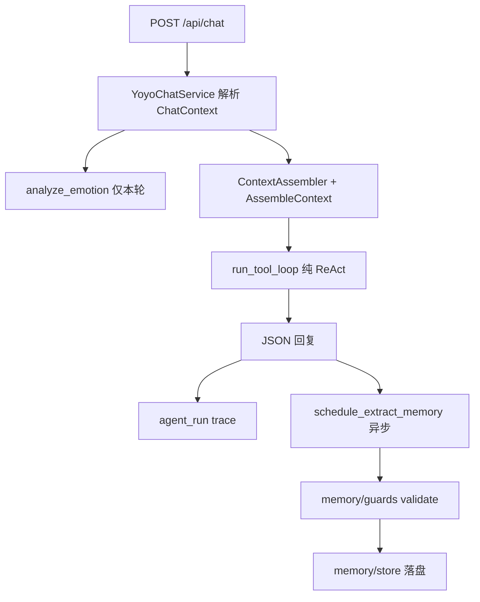

# Agent 上下文与记忆重构（2026-06-24）

最后更新：2026-06-24  
**状态**：已完成

## 背景

早期实现曾用 **关键词 IntentRoute**（问候/游戏/devtools regex）分流 direct/memory/tool，并用 **regex 记忆策略**（角色名表、`_REMEMBER_HINT`）决定写入 scope。维护成本高且易错写（如游戏 lore 进 `MEMORY.md`、Agent 元信息进群记忆）。

## 已删除（勿再引用）

| 路径 | 原因 |
|------|------|
| `execution/router.py` | 关键词分流 |
| `execution/direct.py` | 绑定 router 的短路径 |
| `memory/policy.py` | lore/角色名 regex 决定 memory scope |
| `execution/search_intent.py` | 搜索关键词预绑定 |
| `execution/emoticon_intent.py` | 表情包关键词预绑定 |
| `execution/vision_intent.py` | 看图关键词（vision 改由 `has_images` 结构信号） |
| `memory/intent.py` 中 `detect_memory_writes` 等 regex 抽取 | 由异步 ExtractMemory 替代 |

## 当前架构（快照）

### 执行路径

- **单路径 ReAct**：`AgentRunner` 始终调用 `run_tool_loop`；无 direct/memory 单独 LLM 路径。
- **渐进工具披露**：system 注入轻量【工具目录】；首轮仅 `activate_tools`；模型按需激活业务工具 schema。
- **trace `route`**：`direct` / `tools` 仅表示本轮是否实际调用过业务工具（观测用），**不做分流**。

### 上下文组装

| 模块 | 路径 |
|------|------|
| 组装入口 | `src/agent/context/assembler.py` |
| 结构信号 | `AssembleContext`：`has_images`、`is_master`、`emoticon_enabled`、`legacy_full_prompt` |
| Playbook | `prompts/system/core.md` + `prompts/playbooks/*.md`（按结构信号加载，非关键词） |
| 记忆读注入 | `memory/context.py` → `build_memory_context` |
| 词条定位 | `knowledge/term_resolver.py`（数据驱动，非硬编码角色表） |

Playbook 默认（非 legacy）：`permissions`、`memory`、`game-query`；有图加 `vision`；master 加 `filesystem`/`script`/`skills-*`。

### 记忆读写

| 操作 | 路径 | 说明 |
|------|------|------|
| 同步写 | `tools/memory.py` + `memory/guards.py` | LLM 调 `memory` 工具；守卫拒绝 lore/图鉴/agent 元信息 |
| 异步写 | `memory/extract.py` | 回复后 LLM 结构化 JSON；经 guards 后落盘 |
| 读 | `memory/store.py` + `memory_search` | respond 前注入 top 片段 |
| **不写** | 瞬时情绪 | `analyze_emotion` 仅本轮 `[用户情绪]` 注入，**不落盘** `users.yaml` |

### 用户画像（users.yaml）

- 路径：`memory/data/group/{id}/users.yaml`（非旧文档中的 `USER.md`）
- 字段：`nickname`、`preferences`、`notes`、`from_others`（他人评价）
- **不含** `emotion` 历史日志；长期性格可写 `preference`/`note`，由模型归纳

### 插件侧（非 Agent 语义路由）

- 唤醒词：`config agentWakeWords` + `api/agent/trigger.js`（触发层 regex，与 server 分流无关）
- `@` + 唤醒词均可触发；缓冲与 HTTP 契约见 [`../../07-agent-integration.md`](../../07-agent-integration.md)

## 配置

| 字段 | 默认 | 说明 |
|------|------|------|
| `agentLegacyFullPrompt` | `false` | `true` 时加载全部 playbook（临时兼容） |

## 验收

- [x] 无 `_GREETING_RE` / `_LORE_RE` / IntentRoute 参与分流
- [x] 任意消息经 `run_tool_loop`
- [x] lore 写入 MEMORY 被 `guards` 拒绝
- [x] 情绪不落盘 users.yaml
- [x] 测试：`tests/test_context_assembler.py`、`test_memory_guards.py`、`test_runner_react.py` 等

## 刻意不做

- **关键词 IntentRoute**（已否决；见本文「已删除」）
- **小模型前置分类**（当前纯 ReAct + playbook 引导）
- **Observational Direct**（首轮无 tools 试探；用户选定纯 ReAct）
