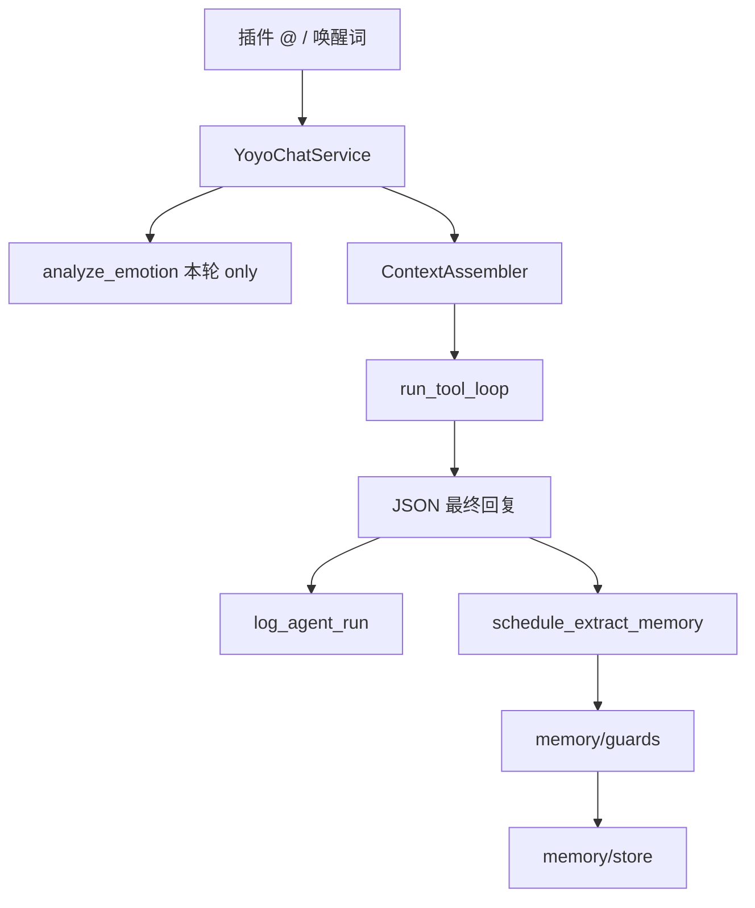

# YoAgent 架构总览（Token-First）

最后更新：2026-06-24

## 设计原则

1. **仅 respond 触发 LLM**：插件缓冲入库 0 token；YoAgent 只在 `@`/唤醒词后跑 Agent。
2. **纯 ReAct + 渐进工具**：无关键词 IntentRoute；模型通过 tool catalog + playbook 自选工具。
3. **上下文按需组装**：core + 条件 playbook + 记忆读注入；禁止整群历史进 prompt。
4. **Harness 管环境，Loop 管循环**：`context/` + `memory/` 组装；`execution/loop.py` 循环。
5. **写记忆与读记忆分离**：同步 `memory` 工具 + 异步 `extract.py`；守卫拦截 lore 错写。

## 分层

```
Prompt / Context / Harness / Loop
         ↑              ↑
    Token 组装      ReAct + activate_tools
```

| 层 | YoAgent 路径 | 职责 |
|----|--------------|------|
| API | `src/api/` | HTTP/SSE |
| Harness | `src/agent/` | 记忆、工具、Skills、ContextAssembler、guards |
| Loop | `src/agent/execution/loop.py` | step、渐进 schema、max_step |
| 触发滤 | yoyo-plugin | 白名单群、`@`、唤醒词（`agentWakeWords`） |

## 单次回复路径（当前实现）



## 与旧规划差异

| 旧规划 | 当前实现（2026-06-24） |
|--------|------------------------|
| IntentRoute direct/memory/tool | **已否决**；单路径 ReAct |
| `planning/planner.py` 规则分流 | **不存在**；已删 router/policy |
| regex 记忆 scope | **`memory/guards.py`** 数据驱动冲突检测 |
| regex 异步记忆抽取 | **`memory/extract.py`** LLM 结构化 JSON |
| 情绪写入 users.yaml | **不落盘**；仅 `[用户情绪]` 本轮注入 |
| `default.txt` 巨型 system | **`core.md` + playbooks/** 按需加载 |

## 文档索引

| 主题 | 文件 |
|------|------|
| 重构快照 | [../progress/phase-context-refactor-2026-06.md](../progress/phase-context-refactor-2026-06.md) |
| Token 总策略 | [token-strategy.md](token-strategy.md) |
| 上下文组装 | [context-assembly.md](context-assembly.md) |
| 记忆与 Token | [memory-token-policy.md](memory-token-policy.md) |
| ReAct 链路 | [react-short-path.md](react-short-path.md) |
| 记忆系统 | [memory-system.md](memory-system.md) |

## 代码落点

| 模块 | 路径 |
|------|------|
| 入口 | `src/agent/runner.py` |
| 上下文组装 | `src/agent/context/assembler.py` |
| ReAct 循环 | `src/agent/execution/loop.py` |
| 记忆守卫 | `src/agent/memory/guards.py` |
| 异步抽取 | `src/agent/memory/extract.py` |
| 记忆存储 | `src/agent/memory/store.py` |
| 本轮情绪 | `src/agent/memory/emotion.py`（只读分析） |
| 对接服务 | `src/services/yoyo_chat_service.py` |
