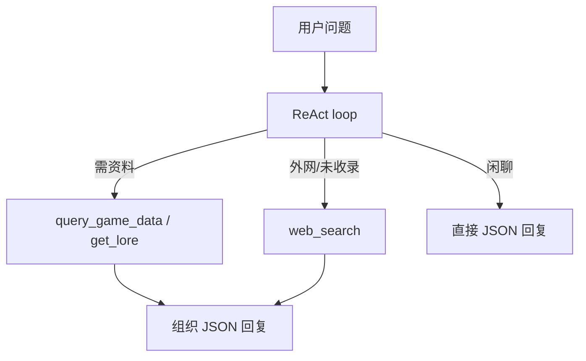

# 游戏资料接入与检索架构

最后更新：2026-06-24

> lore 目录注入现由 `ContextAssembler` 完成；游戏事实 **禁止** 写入 MEMORY（见 `memory/guards.py`）。

## 当前实现（MVP）

**数据源**：插件 `data/game/*.yaml`（Wiki 拉取缓存，见 [`../../04-wiki-data-and-cache.md`](../../04-wiki-data-and-cache.md)）。YoAgent **只读 YAML**，按 mtime 内存缓存，**尚未**上 SQLite FTS。

| 模块 | 路径 | 说明 |
|------|------|------|
| 路径解析 | `src/agent/knowledge/paths.py` | 定位插件 `data/game/` |
| 加载缓存 | `src/agent/knowledge/store.py` | `GameDataStore`：hero/pet/spirit/item/accessory/profession + lore |
| 筛选查询 | `src/agent/knowledge/query.py` | 子串匹配筛选，返回裁剪字段 |
| Lore 检索 | `src/agent/knowledge/lore.py` | 章节标题 / 关键词搜索 |
| 格式化 | `src/agent/knowledge/format.py` | 截断、`TOOL_RESULT_MAX_CHARS` |
| 工具 | `src/agent/tools/get_lore.py` | 世界观 / 设定 |
| 工具 | `src/agent/tools/query_game_data.py` | 六类实体筛选 |
| 工具 | `src/agent/tools/web_search.py` | Jina 外网补充 |
| 目录注入 | `src/agent/context/assembler.py` | `build_lore_catalog` 短索引 |
| 人设 | `src/agent/prompts/system/core.md` + `persona.md` | 薄 system + playbook |

### 已落地工具

| 工具 | 用途 | 数据文件 |
|------|------|----------|
| `get_lore` | 普罗米利亚 / 游戏信息合集章节检索 | `data/game/lore/promilia.yaml`、`game-info.yaml` |
| `query_game_data` | `entity` = hero / pet / spirit / item / accessory / profession，支持 `filters` 组合 | 对应 `data/game/*.yaml` |
| `web_search` | 未收录 / 最新动态 | 外网 |

`query_game_data` 常用筛选示例：

- hero：`element`、`profession`、`group`、`weapon`、`name` 等；**按 `name` 查询附带 `skillSummary`（满级星决技/星鸣技/普攻倍率）**
- pet：`element`、`race`、`stage`、`tag`（剧情特殊奇波 `page` 含「（特殊）」已过滤）
- accessory：`type_name`、`suit_name`、`name`

### 已知限制

- 检索为 **YAML 全量加载 + Python 线性筛选**，非 FTS；资料量大后再上 SQLite（见下文「规划」）
- `hero.yaml` 含 `weapon` 等字段，但 **accessory.yaml 无「镰刀」类武器名**，武器适配题应查 hero 的 `weapon` 字段
- LLM 多轮 `tool_calls` 须用 LangChain 的 `args` 字段（`src/agent/llm/provider.py` 归一化）

### 验收（已测）

- [x] 「阿比用什么武器」→ `query_game_data` 命中 `weapon: 镰刀`
- [x] `tests/test_game_knowledge.py` 覆盖加载、筛选、lore、截断

---

## 目标（长期）

在 **2 核 4G** 服务器上，让 QQ 群 Agent **按需**读取游戏资料，同时：

1. **扮演好群聊角色**（Persona 与人设提示词）
2. **省 token**（窄注入、少 ReAct、不全文塞 prompt）
3. **默认不用在线 embedding**（检索以关键词 / FTS / 结构化查询为主）

## 设计原则

| 原则 | 说明 |
|------|------|
| **资料 ≠ 记忆** | 游戏 wiki 进 **本地知识库**；群聊用户偏好进 **Mem0**（可选云 API） |
| **结构化走 SQL** | 角色面板、奇波数值等 **禁止**当长文本 RAG |
| **文本走 FTS** | 攻略、 lore、角色故事用 **SQLite FTS5** 或预建倒排索引 |
| **导入时切片** | chunk 在 **离线导入** 完成，查询时只取 top-2 条 |
| **渐进工具** | ReAct + `activate_tools`；模型按需查库，非关键词预绑 |
| **不用本机 BGE-M3** | 与 Agent 同机 4G 内存不足；见下文 L2 可选方案 |

## 资料分类与接入方式

| 类型 | 示例 | 存储形态 | Agent 接入 | 检索方式 |
|------|------|----------|------------|----------|
| **背景 / 世界观** | 普罗米利亚设定、阵营 | 分类文本文件 → DB | `get_lore` 工具 | 分类 ID + FTS |
| **角色信息（文本）** | 人设、语音梗、剧情 | `character_profiles` 表 | `get_character_profile` | **实体名精确匹配** + 别名表 |
| **角色相关文本** | 命座、武器故事 | 关联 `character_id` | 同上或 `lookup_entity` | 外键查询 |
| **攻略文本** | 配队、副本、奇波培养 | `guide_chunks` + FTS | `search_guides` | **FTS5 关键词**，top-k=2 |
| **角色数据（结构化）** | 攻击、技能倍率、属性 | `characters` / `skills` JSON 表 | `query_character_stats` | **SQL 按名/ID**，返回裁剪 JSON |
| **奇波 / 道具等数据** | 种族、技能、掉落 | `kibo` / `items` 表 | `lookup_entity` | SQL + 类型枚举 |
| **后台运营数据** | 活动表、公告摘要 | admin API 或 `cms_*` 表 | `get_game_notice` | 时间 + 分类，带 `version` |

**硬规则**：结构化数据 **不得**整表或长 JSON 注入 prompt；工具返回经 `TOOL_RESULT_MAX_CHARS` 截断。

## 检索分层（规划 · 部分已实现为 YAML 工具）

> 下图 IntentRoute 为早期规划；**当前**为纯 ReAct + `query_game_data`/`get_lore`。SQLite FTS 仍为待办。



| 层级 | 手段 | 运行时成本 | 适用 |
|------|------|------------|------|
| **L0** | 实体别名 + SQL / 主键 | 0 token 检索 | 「某某攻击力多少」 |
| **L1** | SQLite **FTS5** | 0 embedding | 攻略、长文关键词 |
| **L2** | 预计算轻量向量（**离线批处理**，可选） | 查询时仅读盘 cosine | FTS 召回不足时 fallback |
| **L3** | Mem0 云 API | 不占本机内存 | 仅 **用户偏好/群梗** |
| **L4** | Jina `web_search` | 外网 API | 版本新闻、未收录内容 |

**默认路径：L0 + L1**，不启 L2 也能跑满大部分群聊问答。

### 为何不用「每次在线 Embedding」

- 2C4G 跑 BGE 类模型易 OOM，且每次 respond 多一次网络/推理延迟。
- 游戏资料 **实体边界清晰**（角色名、奇波名、副本名），规则 + FTS 性价比更高。
- Token 策略：检索结果 **最多 2 段 × 每段 ≤400 字** 进 prompt（见 [token-strategy.md](token-strategy.md)）。

### L2 可选（资料量极大时）

- 部署外单独跑 **离线任务**（非请求路径）：`bge-small-zh` 对 `guide_chunks` 批处理写 `chunk_embeddings` 表。
- 查询：FTS 先取 20 候选 → 本地 numpy cosine 取 top-2（内存占用可控）。
- **禁止**在 `respond` 热路径调用 OpenAI/Jina Embedding API。

## 工具设计（Harness）

**当前已注册**：`get_lore`、`query_game_data`、`web_search`（见上「当前实现」）。

**规划扩展**（SQLite/FTS 落地后按需增加工具 schema）：

| 工具 | 用途 | 状态 |
|------|------|------|
| `get_lore` | 世界观分类文本 | **已实现** |
| `query_game_data` | 六类实体筛选 | **已实现** |
| `web_search` | 外网补充 | **已实现** |
| `lookup_entity` / `search_guides` 等 | FTS/SQL 增强 | 规划 |

模型通过 playbook `game-query` + lore 目录 + `activate_tools` 自选工具；**不用**关键词规则预绑。

## Persona（群聊角色）

与资料库分离：

| 层 | 位置 | 内容 |
|----|------|------|
| 默认人设 | `prompts/system/core.md` + `persona.md` | 寒悠悠 + QQ JSON 回复约束 |
| 群专属角色 | DB `personas` 或 `prompts/persona/{group}.txt` | 口癖、自称、是否剧透 |
| 世界观约束 | `prompts/game/world_rules.txt` | 专有名词、禁止 OOC 的硬线 |

组装顺序见 [context-assembly.md](context-assembly.md)。

## 存储与目录（2C4G）

见 [../structure/data-storage.md](../structure/data-storage.md) 游戏库章节。

单机推荐：

```
YoAgent 进程        ~300–500 MB
SQLite (消息+游戏库)  ~50–500 MB（视资料量）
FTS 索引             含于 SQLite
Mem0                 云 API（本机不跑向量模型）
```

## 离线导入管线（非热路径）

1. 运营提供：文本目录 + JSON/CSV 导出 + 后台 API（可选）
2. `scripts/import_game_data.py`（规划）写入 SQLite
3. 文本切片 → `guide_chunks` / `lore_sections`，写入 FTS
4. 实体 → `entities` + `entity_aliases`（支持昵称、简称）
5. 发布 `game_data_version`；Agent 启动时读版本号，**内存缓存只读索引**

导入与 respond **解耦**，不占群聊延迟。

## 与 Mem0 的分工

| Mem0 记 | 不记 |
|---------|------|
| 用户偏好（「我主玩雷系」） | 角色攻击力（查库） |
| 群内热梗、称呼 | 攻略正文（查 FTS） |
| 上次聊到哪 | 全量 wiki |

## YoAgent 代码落点

| 模块 | 路径 | 状态 |
|------|------|------|
| 游戏库访问 | `src/agent/knowledge/store.py` | **已实现** |
| 筛选查询 | `src/agent/knowledge/query.py` | **已实现** |
| Lore | `src/agent/knowledge/lore.py` | **已实现** |
| 游戏工具 | `src/agent/tools/get_lore.py`、`query_game_data.py` | **已实现** |
| FTS / 实体解析 | `src/agent/knowledge/search.py` | 规划 |
| 上下文注入 | `src/agent/context/assembler.py` | **已实现** |
| 导入脚本 | `scripts/import_game_data.py` | 规划 |
| 数据文件 | `data/game/`（插件仓，YoAgent 只读） | **在用** |

## 验收（资料向）

**MVP（已通过）**

- [x] 问武器/职业：YAML 筛选返回与数据一致（如阿比 → 镰刀）
- [x] 问 lore：章节关键词命中 `get_lore`
- [x] 工具结果经 `agentToolResultMaxChars` 截断

**长期（SQLite FTS 后）**

- [ ] 问攻略：FTS 命中正确 chunk，注入 prompt ≤2 段
- [ ] 闲聊：无工具时 trace `route=direct`
- [ ] 2C4G 压测：并发 2 respond 内存 < 3.5G

## 相关文档

- [game-context.md](game-context.md) — 游戏基本信息
- [token-strategy.md](token-strategy.md) — token 预算
- [memory-token-policy.md](memory-token-policy.md) — Mem0 边界
