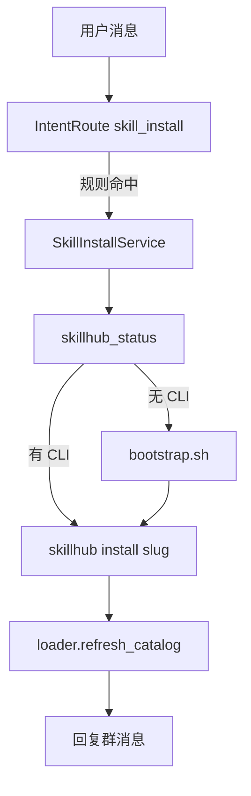

# SkillHub 技能安装集成

最后更新：2026-06-24

> **注意**：下文「IntentRoute / planning/planner.py」为 **2026-06 规划**，已于 2026-06-24 重构中**否决**。当前由纯 ReAct + `load_skill`/`save_skill` + playbook 引导；安装类请求不再靠关键词预绑工具集。

来源：[skillhub.cn](https://skillhub.cn/)

## 目标效果

用户自然语言（群聊或 API）例如：

```text
请先检查是否已安装 SkillHub 商店，若未安装，请根据 https://skillhub.cn/install/skillhub.md 安装 SkillHub 商店，
然后安装 bilibili-downloader-plus 技能。若已安装，则直接安装 bilibili-downloader-plus 技能。
```

Agent 自动完成：**检测 CLI →（可选）安装商店 → 安装指定 skill → 刷新本地 catalog → 回复结果**。

## 前提（SkillHub 侧）

| 项 | 说明 |
|----|------|
| CLI | `skillhub` 命令（[安装脚本](https://skillhub.cn/install/skillhub.md) 或 `npm i -g @astron-team/skillhub`） |
| 安装 skill | `skillhub install <slug> --dir <dir> --json` |
| 检测 | `skillhub version --json` / `skillhub list --dir <dir> --json` |
| YoAgent 无内置 agent profile | **必须 `--dir`** 指向 `server/skills/` |

推荐安装命令（YoAgent 固定目录）：

```bash
skillhub install bilibili-downloader-plus \
  --dir "${YOAGENT_SKILLS_DIR:-./skills}" \
  --force --json
```

商店/bootstrap（CLI 未安装时）：

```bash
curl -fsSL https://skillhub-1388575217.cos.ap-guangzhou.myqcloud.com/install/install.sh | bash
# 或仅 CLI：... | bash -s -- --cli-only
```

## YoAgent 现状缺口

| 已有 | 缺失 |
|------|------|
| `skills/` 目录空壳 | `skillhub` CLI 封装 |
| `loader.py` 空壳 | 实际加载已安装 SKILL.md |
| `tools/registry.py` 空壳 | SkillHub 专用 tools |
| 无 execution loop | 工具调用链 |
| 无 shell 能力 | 受控 subprocess |

## 需新增模块（按层）

### 1. 配置 — `src/core/settings.py`

```env
SKILLS_DIR=./skills
SKILLHUB_REGISTRY=          # 可选，默认 CLI 内置
SKILLHUB_ALLOW_BOOTSTRAP=true
SKILLHUB_BOOTSTRAP_SCRIPT=https://skillhub-1388575217.cos.ap-guangzhou.myqcloud.com/install/install.sh
```

### 2. SkillHub 客户端 — `src/agent/integrations/skillhub/`（新建）

| 文件 | 职责 |
|------|------|
| `client.py` | subprocess 调 `skillhub * --json`；解析 ok/message |
| `bootstrap.py` | 检测 CLI；允许listed 执行 install.sh |
| `paths.py` | 解析 `SKILLS_DIR` 绝对路径 |

**不要**把任意 shell 暴露给 LLM；仅封装固定子命令。

### 3. Agent Tools — `src/agent/tools/skillhub_tools.py`（新建）

| Tool | 作用 | 对应用户意图 |
|------|------|--------------|
| `skillhub_status` | CLI 是否可用、version、已安装 slug 列表 | 「检查是否已安装商店」 |
| `skillhub_bootstrap` | 未安装时跑 bootstrap 脚本 | 「安装 SkillHub 商店」 |
| `skillhub_install` | `install <slug> --dir skills/` | 「安装 bilibili-downloader-plus」 |

注册到 `tools/registry.py`；IntentRoute=**skill_install** 时**只暴露这 3 个 tool**（省 token）。

### 4. Skills 层 — 补全现有空壳

| 文件 | 职责 |
|------|------|
| `skills/loader.py` | 扫描 `skills/*/SKILL.md`；元数据列表；按需读全文 |
| `skills/catalog.py`（可选） | 安装后 invalidate 缓存 |
| `filesystem/workspace.py` | 读 `skills/`、检查目录是否存在 |

### 5. 内置 Meta Skill — `skills/skillhub/SKILL.md`（新建，随仓库提交）

教 Agent 标准流程（**渐进披露：仅 skill_install 路径加载**）：

1. 先调 `skillhub_status`
2. 若 CLI 缺失 → `skillhub_bootstrap`
3. 再 `skillhub_install(slug=...)`
4. 回复安装结果；**不要**重复安装

可后续改为从 SkillHub 安装「商店 skill」覆盖本地副本。

### 6. Planning / IntentRoute — `planning/planner.py`

规则（零 token）匹配：

- 「安装技能」「skillhub」「install skill」→ route=`skill_install`
- 从消息提取 slug（正则：`install\s+([\w-]+)` 或中文「安装 xxx 技能」）

**优先确定性路径**：匹配成功时可 **不经过 LLM**，直接 Python 调用 `client.install(slug)` 返回群消息（最省 token）。LLM 路径作为兜底。

### 7. Execution — 依赖最小 Loop

| 模式 | 说明 |
|------|------|
| **A. 确定性（推荐 MVP）** | `skill_install` → service 直接调 SkillHub client → 返回文本，**0 LLM** |
| **B. Tool Loop** | `skill_install` → Short ReAct + 3 tools + meta skill 摘要 |

### 8. API（可选）

`POST /v1/skills/install` body `{ "slug": "bilibili-downloader-plus" }` — 供插件或运维，绕过 LLM。

## 调用链（推荐 MVP）



## 安全与护栏

| 项 | 做法 |
|----|------|
| 禁止通用 shell tool | 仅 SkillHub 封装 |
| bootstrap | 开关 `SKILLHUB_ALLOW_BOOTSTRAP`；仅 HTTPS 固定 URL |
| 安装目录 | 锁死在 `SKILLS_DIR`；slug 正则 `^[\w-]+$` |
| 超时 | subprocess 120s |
| 网络 | 部署环境需能访问 skillhub registry |

## 与 Token 策略关系

- 安装技能 = **运维类意图** → 走 **确定性路径**，不用 ReAct 全链
- Meta skill **不进**默认 prompt；仅 `skill_install` 或 slug 未知时注入摘要

## 实施顺序

1. `integrations/skillhub/client.py` + 单测（mock subprocess）
2. `SkillInstallService` 确定性流程
3. `loader.py` 扫描 `skills/`
4. IntentRoute 规则 + `/respond` 接入
5. （可选）Tool Loop + `skillhub_tools.py`
6. 内置 `skills/skillhub/SKILL.md`

## 验收

- [ ] 未装 CLI：一条消息完成 bootstrap + install slug
- [ ] 已装 CLI：跳过 bootstrap，直接 install
- [ ] `skills/bilibili-downloader-plus/SKILL.md` 存在
- [ ] `skillhub list --dir ./skills --json` 含该 slug
- [ ] 重复安装同 slug 不报错（`--force` 或幂等）

## 不在 MVP

- SkillHub login / 私有 namespace token
- `skillhub search` 交互式浏览
- MCP 封装 SkillHub（可演进）
