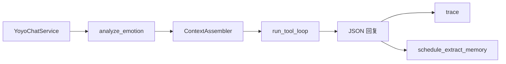

# 核心业务流程

最后更新：2026-06-24

## 消息处理（插件侧，0 token）

1. 白名单群内消息 → 内存缓冲（`api/agent/buffer.js`）
2. `@` 机器人或 **唤醒词**（`agentWakeWords`）→ `POST /api/chat`
3. 触发后清空缓冲；跨轮见 `agentSessionHistoryTurns`

## 回复处理（YoAgent）

1. **解析** — OneBot messages → `ChatContext`（权限、vision 候选、@ 用户）
2. **组装** — `ContextAssembler` + `AssembleContext` 结构信号
3. **执行** — 纯 ReAct loop（渐进 `activate_tools`）
4. **返回** — `YoyoChatResponse`（JSON bubbles / 多段 replies）
5. **异步** — ExtractMemory + 情绪**不**落盘

## 记忆分层（当前）

| 层级 | 存储 | 进 Prompt |
|------|------|-----------|
| Playbook + core | 文件 | 条件加载 |
| 长期记忆 | MEMORY.md / users.yaml | 读注入截断 |
| Session | 进程内 | 最近 N 轮 QA |
| 群缓冲 | 插件进程 | 单次 @ 上下文 |
| 游戏资料 | YAML | 工具按需查，lore 目录短注入 |

## 详细策略

- [architecture.md](architecture.md)
- [context-assembly.md](context-assembly.md)
- [memory-token-policy.md](memory-token-policy.md)
- [../progress/phase-context-refactor-2026-06.md](../progress/phase-context-refactor-2026-06.md)
